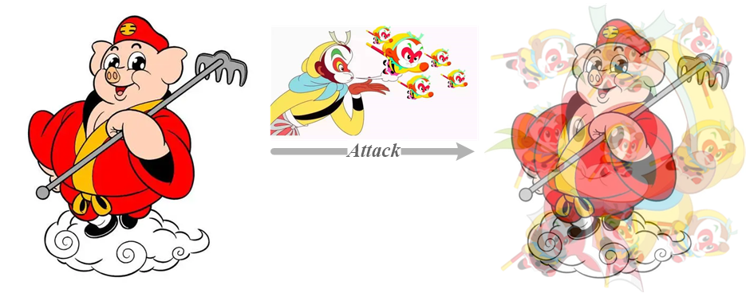

# Everywhere_attack
Codes for our paper to 2025AAAI: Everywhere Attack: Attacking Locally and Globally to Boost Targeted Transferability. 

The proposed method can be illustrated with the following figure. To fool a DNN model to misclassify a 'Bajie' image as 'Wukong', we plant an army of 'Wukong's to the 'Bajie'. Specifically, we split the 'Bajie' image into non-overlap blocks abd jointly mount a targeted attack on each block. Such a strategy avoids transfer failures caused by attention inconsistency between surrogate and victim models and thus results in strong transferability.  

## Usage
Please run everywhere_demo.py to see the targeted transferability improvement by the proposed everywhere method.
